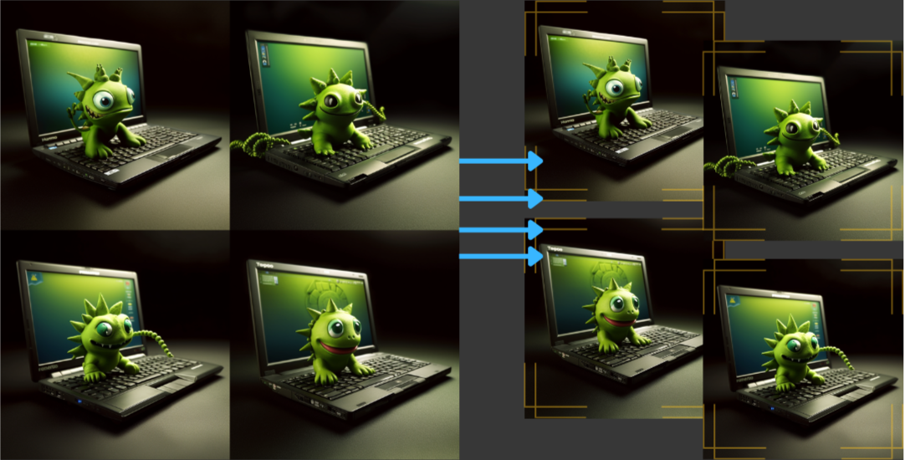

# IZDU Slicer

Image Zero Disk Usage Slicer

Splits an image into 4 separate images of the same size, each dimension of original image is halved.



## Usage

#### Runninng
Runs on port :9090 by default. Set env variable `PORT` to change it.


#### Request
Send `POST` to `:9090` with the following JSON body:
```json
{
    "image_url": "<url to image>"
}
```
Optionally you can specify `?scale=<size>` (size in px) to downscale the image. 
Aspect ratio will be preserved.
**0 means no scaling**.

#### Response
You'll receive Response Stream. 
Each chunk represents a single image, yet **you should not rely on chunks too much**.
In case of small images (downscaled) multiple chunks might be sent quickly.
You need to parse the total byte sequence and find the beginning of each image.

For PNG (the only supported format for now) you should search for (0x87 PNG) header:

`HEX: [0x89, 0x50, 0x4E, 0x47]` or
`Decimal: [137, 80, 78, 71]`

## Testing & Implementation

#### CLI client


Feel free to use [CLI client](https://github.com/eli-l/IZDU-slicer-test-client) for testing and example purposes.

Grab pre-compiled binary from [the latest release](https://github.com/eli-l/IZDU-slicer-test-client/releases).


