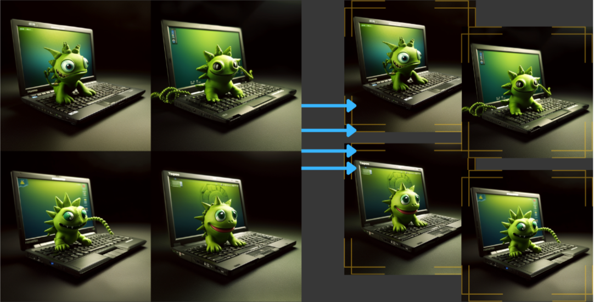

# IZDU Slicer

Image Zero Disk Usage Slicer

Splits an image into 4 separate images of the same size, each dimension of the original image is halved. All processing happens in memory — no intermediate files are written to disk.



## Usage

### Endpoints

| Endpoint | Description |
|----------|-------------|
| `POST /slice` | Split image into 4 quadrants. Optional `watermark` text applied to each slice. |
| `POST /watermark` | Apply watermark text to an image, return as single PNG. |
| `POST /resize` | Resize an image. Supports `width`, `height`, and `aspect_ratio` params. |

### Running

Runs on port `9090` by default. Set env variable `PORT` to change it.

### Request

Send `POST` to `:9090` with a JSON body:

```json
{
    "image_url": "https://example.com/image.png"
}
```

or

```json
{
    "image_base64": "<base64 encoded image>"
}
```

Alternatively, send raw binary image data with `Content-Type: image/png`.

### `/slice` params

| Param | Default | Description |
|-------|---------|-------------|
| `scale` | 300 | Target size in pixels. `0` = no scaling. |
| `watermark` | — | Text to render as watermark on each slice. |
| `transparency` | 30 | Watermark opacity, 0–100. |

### `/watermark` params

| Param | Default | Description |
|-------|---------|-------------|
| `text` | required | Text to render as watermark. |
| `transparency` | 30 | Watermark opacity, 0–100. |

### `/resize` params

| Param | Description |
|-------|-------------|
| `width` | Target width in pixels. |
| `height` | Target height in pixels. |
| `aspect_ratio` | `preserve` (default) or `ignore` (requires both width & height). |

### Response — `/slice`

Stream of raw PNG bytes for each of the 4 slices, one after another. To split the stream, locate PNG file signatures in the byte stream:

`HEX: [0x89, 0x50, 0x4E, 0x47]` or `Decimal: [137, 80, 78, 71]`

The last image ends when the stream closes.

## Testing & Implementation

### CLI client


Use the [CLI client](https://github.com/eli-l/IZDU-slicer-test-client) for testing and example purposes. Pre-compiled binaries available on the [releases page](https://github.com/eli-l/IZDU-slicer-test-client/releases).